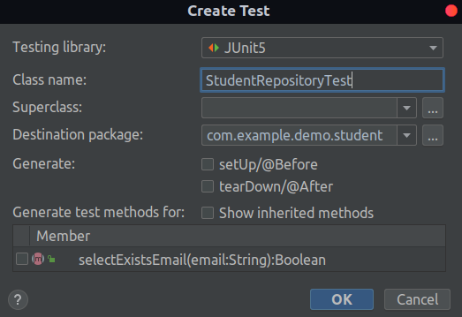

# [Software Testing Tutorial - Learn Unit Testing and Integration Testing](https://youtu.be/Geq60OVyBPg)

### Dependência para testes

* AssertJ

    ```xml
    <dependency>
      <groupId>org.assertj</groupId>
      <artifactId>assertj-core</artifactId>
      <version>3.18.1</version>
    </dependency>
    ```

* JUnit 5

    ```xml
    <dependency>
      <groupId>org.junit.jupiter</groupId>
      <artifactId>junit-jupiter</artifactId>
      <version>5.7.1</version>
    </dependency>
    ```

* Mockito

    ```xml
    <dependency>
      <groupId>org.mockito</groupId>
      <artifactId>mockito-core</artifactId>
      <version>3.6.28</version>
    </dependency>
    ```
    ```xml
    <dependency>
      <groupId>org.mockito</groupId>
      <artifactId>mockito-junit-jupiter</artifactId>
      <version>3.6.28</version>
    </dependency>
    ```

### Atalhos Intellij IDEA

* Criar uma classe de teste a partir de uma classe

    * `CTRL + SHIFT + T` > clicar no botão `Create New Test...`

      

### Teste de Jpa Repositories

```java

@DataJpaTest
class StudentRepositoryTest {

    @Autowired
    private StudentRepository underTestStudentRepository;

    @Test
    void itShouldCheckWhenStudentEmailExists() {
        // given
        String email = "jamila@gmail.com";
        Student student = new Student(
                "Jamila",
                email,
                FEMALE
        );
        underTestStudentRepository.save(student);

        // when
        boolean expected = underTestStudentRepository.selectExistsEmail(email);

        //then
        assertThat(expected).isTrue();
    }
}
```

* `@DataJpaTest`: injetar o repositório JPA e conectar com o banco de dados para teste (no caso, H2 DATABASE)

```java

@DataJpaTest
class StudentRepositoryTest {

    @Autowired
    private StudentRepository underTestStudentRepository;

    @AfterEach
    void tearDown() {
        underTestStudentRepository.deleteAll();
    }

    //...

}
```

* `@AfterEach`: após cada teste, o método anotado com essa anotação será executado

> **OBS**: os métodos fornecidos pelo _Spring Data JPA_ são testados antes de cada _release_ do Spring. Portanto, apenas as _queries_ customizadas (exemplo: `selectExistsEmail(...)`) precisam ser testadas

### Teste de Services

```java
class StudentServiceTest {

    @Test
    void getAllStudents() {
    }

    @Test
    @Disabled
    void addStudent() {
    }

    @Test
    @Disabled
    void deleteStudent() {
    }

}
```

* `@Disabled`: desabilitar um teste

```java
class StudentServiceTest {

    @Mock
    private StudentRepository studentRepository;
    private AutoCloseable autoCloseable;
    private StudentService underTest;

    @BeforeEach
    void setUp() {
        autoCloseable = MockitoAnnotations.openMocks(this);
        underTest = new StudentService(studentRepository);
    }

    @AfterEach
    void tearDown() throws Exception {
        autoCloseable.close();
    }

    // ...

}
```

> **OBS**: como `StudentRepository` já foi testado, não é necessário criar uma instância real dele. Por isso, é recomendado utilizar um _mock_ dessa classe. Dessa forma o teste se torna mais rápido e performático, uma vez que esse _mock_ não se conecta com o banco de dados (criação/remoção de tabelas, inserção de dados, etc)

* `@Mock`: criar uma instância _mockada_ de uma classe

* `MockitoAnnotations.openMocks(this)`: criar todos os _mocks_ (anotados com `@Mock`) da classe a ser testada

```java

@ExtendWith(MockitoExtension.class)
class StudentServiceTest {

    @Mock
    private StudentRepository studentRepository;
    private StudentService underTest;

    @BeforeEach
    void setUp() {
        underTest = new StudentService(studentRepository);
    }

    // ...

}

// @ExtendWith(MockitoExtension.class) É equivalente a:

class StudentServiceTest {

    @Mock
    private StudentRepository studentRepository;
    private AutoCloseable autoCloseable;
    private StudentService underTest;

    @BeforeEach
    void setUp() {
        autoCloseable = MockitoAnnotations.openMocks(this);
        underTest = new StudentService(studentRepository);
    }

    @AfterEach
    void tearDown() throws Exception {
        autoCloseable.close();
    }

}
```

```java
class StudentServiceTest {

    // ...

    @Test
    void canAddStudent() {
        // given
        Student student = new Student(
                "Jamila",
                "jamila@gmail.com",
                FEMALE
        );

        // when
        underTest.addStudent(student);

        // then
        ArgumentCaptor<Student> studentArgumentCaptor = ArgumentCaptor.forClass(Student.class);

        verify(studentRepository).save(studentArgumentCaptor.capture());
    }

    // ...

}
```

* `verify(studentRepository).save(...)`: verificar se `studentRepository` teve o método `save(...)` invocado.

* `studentArgumentCaptor.capture()`: recuperar o `Student` passado como argumento no método `save(...)`
  no `addStudent(...)`

  ```java
  public class StudentService {
      
      // ...
      
      public void addStudent(Student student) {
          Boolean existsEmail = studentRepository
                  .selectExistsEmail(student.getEmail());
          if (existsEmail) {
              throw new BadRequestException(
                      "Email " + student.getEmail() + " taken");
          }
  
          studentRepository.save(student); // .capture() irá recuperar esse "student"
      }
      
      // ...
  }
  ```

```java
class StudentServiceTest {
    
    // ...
    
    @Test
    void willThrowWhenEmailIsTaken() {
        // given
        Student student = new Student(
                "Jamila",
                "jamila@gmail.com",
                FEMALE
        );

        given(studentRepository.selectExistsEmail(anyString()))
                .willReturn(true);

        // when
        // then
        assertThatThrownBy(() -> underTest.addStudent(student))
                .isInstanceOf(BadRequestException.class)
                .hasMessageContaining("Email " + student.getEmail() + " taken");

        verify(studentRepository, never()).save(any());
    }
    
    // ...
  
}
```

* ` verify(studentRepository, never()).save(any())`: como foi lançado uma exceção (`BadRequestException`) no método `addStudent(...)`, pois o email já foi pego, não deve ser executado o método `studentRepository.save(...)`

    ```java
  public class StudentService {
      
      // ...
      
      public void addStudent(Student student) {
          Boolean existsEmail = studentRepository
                  .selectExistsEmail(student.getEmail());
          if (existsEmail) { 
              throw new BadRequestException(
                      "Email " + student.getEmail() + " taken"); // a execução do teste acima deve parar aqui
          }
  
          studentRepository.save(student); // não deve ser executado
      }
      
      // ...
  }
  ```